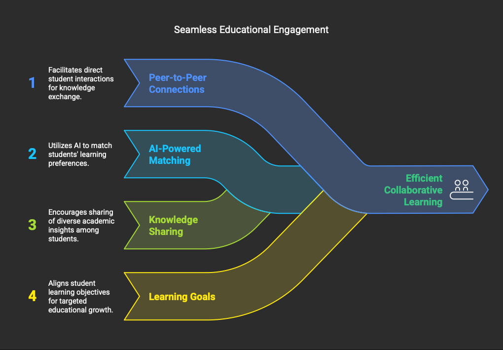
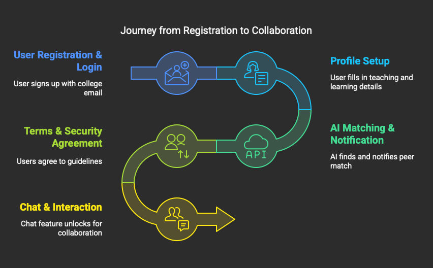

# KnowZ - Skill Exchange Platform

KnowZ is a modern web application that connects people based on complementary teaching and learning skills. Users can find matches who can teach them what they want to learn, and they can teach others what they know, creating a mutually beneficial knowledge exchange network.

## 📑 Table of Contents

- [Overview](#overview)
- [Features](#features)
- [Tech Stack](#tech-stack)
- [Architecture](#architecture)
- [Getting Started](#getting-started)
  - [Prerequisites](#prerequisites)
  - [Backend Setup](#backend-setup)
  - [Frontend Setup](#frontend-setup)
  - [Database Setup](#database-setup)
- [Usage](#usage)
- [API Documentation](#api-documentation)
- [Contributing](#contributing)

## 🌟 Overview

KnowZ facilitates peer-to-peer skill exchange by matching users based on their teaching abilities and learning goals. The platform uses a graph database to efficiently find complementary skill relationships between users, enabling a swipe-based matching system similar to dating apps. Users can find someone who knows what they want to learn, and in return, they can teach skills they've mastered.



## ✨ Features

- **User Authentication**: Secure registration and login with JWT token-based authentication
- **Profile Management**: Create and manage profiles with teaching skills and learning goals
- **Skill Graph**: Add skills you can teach and skills you want to learn
- **AI-Powered Matching**: Find potential matches based on complementary skills
- **Swipe Interface**: Accept or reject potential matches
- **Real-time Messaging**: Communicate with matched users
- **User Dashboard**: View statistics, pending matches, and recent activity
- **Dark/Light Modes**: Customizable UI themes


## 🛠️ Tech Stack

### Backend
- **Framework**: Flask (Python)
- **Authentication**: JWT (JSON Web Tokens) via flask-jwt-extended
- **Database**: ArangoDB (graph database)
- **API**: RESTful architecture
- **Security**: Password hashing via Werkzeug
- **Environment**: Python 3.8+

### Frontend
- **Framework**: React with TypeScript
- **State Management**: React Context API
- **Routing**: React Router
- **Styling**: TailwindCSS
- **Animations**: Framer Motion
- **Icons**: React Icons
- **HTTP Client**: Axios
- **Build Tool**: Vite

## 🏛️ Architecture

KnowZ uses a graph database (ArangoDB) to model the relationships between users and skills:

- **Vertices**:
  - Users
  - Skills

- **Edges**:
  - has_skill (User → Skill): Skills a user can teach
  - wants_to_learn (User → Skill): Skills a user wants to learn

This graph structure enables efficient querying for potential matches, finding users whose teaching skills align with others' learning goals.

## 🚀 Getting Started

### Prerequisites

- Node.js (16.x or higher)
- Python 3.8+
- ArangoDB 3.7+
- Git

### Backend Setup

1. Clone the repository:
   ```bash
   git clone [https://github.com/Bhatt/knowZ.git](https://github.com/BhattAnsh/KnowZ.git)
   cd knowz
   ```

2. Set up a Python virtual environment:
   ```bash
   cd api
   python -m venv venv
   source venv/bin/activate  # On Windows: venv\Scripts\activate
   ```

3. Install dependencies:
   ```bash
   pip install -r requirements.txt
   ```

4. Create a `.env` file with the following variables:
   ```
   ARANGO_URL=http://localhost:8529
   ARANGO_DB_NAME=skillswap
   ARANGO_USERNAME=root
   ARANGO_PASSWORD=your_password
   JWT_SECRET_KEY=your_secret_key
   FLASK_ENV=development
   PORT=8088
   ```

5. Start the Flask server:
   ```bash
   python app.py
   ```

### Frontend Setup

1. Navigate to the frontend directory:
   ```bash
   cd ../frontend
   ```

2. Install NPM dependencies:
   ```bash
   npm install
   ```

3. Start the development server:
   ```bash
   npm run dev
   ```

### Database Setup

1. Install and start ArangoDB following the [official documentation](https://www.arangodb.com/docs/stable/getting-started-installation.html)

2. Create a database named `skillswap` (or match your ARANGO_DB_NAME environment variable)

3. The application will automatically set up collections and indexes on first run

## 💡 Usage

1. **Registration**: Create an account with your username, email, and password. Add your initial teaching skills and learning goals.

2. **Profile Setup**: Fill in your profile with additional teaching skills and learning goals.

3. **Find Matches**: Browse potential matches based on skill compatibility.

4. **Connect**: Swipe right on users you're interested in learning from or teaching. When there's mutual interest, it's a match!

5. **Communicate**: Message your matches to arrange knowledge-sharing sessions.

## 📡 API Documentation

The backend provides the following RESTful API endpoints:

### Authentication
- `POST /register` - Register a new user
- `POST /login` - Authenticate and receive JWT token

### Profile Management
- `GET /profile` - Get user profile with skills
- `PUT /profile` - Update user profile information

### Skills
- `POST /add-skill` - Add a teaching or learning skill
- `POST /remove-skill` - Remove a skill from profile

### Matching
- `POST /predict` - Get potential matches
- `POST /swipe` - Record a swipe decision (accept/reject)
- `GET /matches` - Get confirmed matches
- `POST /pending-matches` - Get matches waiting for approval

### Messaging
- `GET /messages/<match_id>` - Get conversation history
- `POST /messages/send` - Send a message to a match

### System
- `GET /health` - Check API health status

## 🤝 Contributing

Contributions are welcome! Please feel free to submit a Pull Request.

1. Fork the repository
2. Create your feature branch (`git checkout -b feature/amazing-feature`)
3. Commit your changes (`git commit -m 'Add some amazing feature'`)
4. Push to the branch (`git push origin feature/amazing-feature`)
5. Open a Pull Request

---

Built with ❤️ by the KnowZ Team
